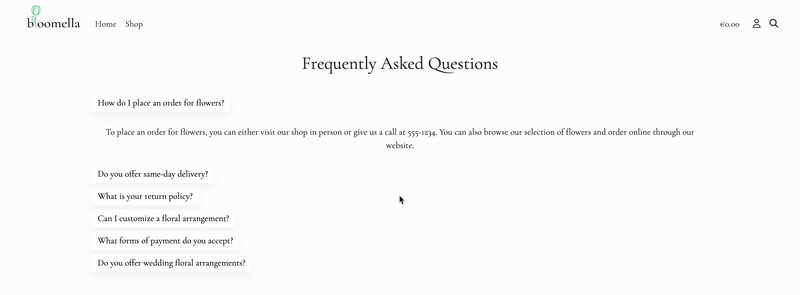
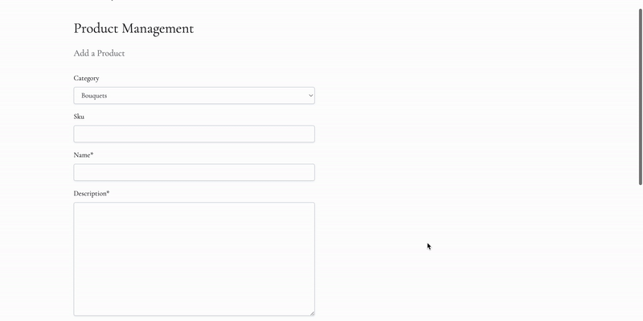

# Bloomella Flower Store

Bloomella is a Django-based E-commerce platform for purchasing flowers online. Our platform is designed to provide a seamless shopping experience for customers looking to purchase flowers for any occasion.

From wedding flowers to gift baskets, our online store has a large selection of fresh flowers, arrangements, and bouquets suitable for any occasion.

At Bloomella, we believe that flowers are an expression of love and care, and that's why we're committed to providing high-quality, hand-picked flowers that are sure to delight our customers.

Our platform is easy to navigate, and our checkout process is quick and secure, ensuring that our customers have a stress-free shopping experience.

Whether you're looking for a bouquet to express your love or a wreath to commemorate a loved one, Bloomella has you covered. We're dedicated to making sure that every customer finds the perfect flowers for any occasion, and we're always here to help if you need any assistance. 

<p align="left">
  
</p> 

#### Click [here](https://bloomella.herokuapp.com/) to visit the website.


# Table of Content

- [User Experience](#user-experience)

* [Admin Experience](#admin-experience)
    
- [Business Model](#business-model)

- [Marketing Strategies](#marketing-strategies)

- [Facebook Page](#facebook-page)

- [Main Objectives](#main-objectives)

- [UX Principles](#ux-principles)

- [Strategy](#strategy)

- [Models](#models)  

- [Features](#features)

  * [Navigation bar](#navigation-bar)

  * [Store Name and Slogan](#store-name-and-slogan)

  * [Key Features](#key-features)

  * [Our Team](#our-team)

  * [Our Story](#our-Story)

  * [Testimonials ](#testimonials)

  * [Subscribe To Our Newsletter](#subscribe-to-our-newsletter)

  * [Footer](#footer)

  * [Products](#products)

  * [Products Details](#products-details)

  * [Shopping Bag](#shopping-bag)

  * [Checkout](#checkout)

  * [Checkout Success](#checkout-success)

  * [Frequently Asked Questions](#frequently-asked-questions)

  * [Add Product](#add-product)

  * [Edit Product](#edit-product)

  * [Unapproved Testimonials](#unapproved-testimonials)

  * [Testimonials List](#testimonials-list)

  * [My Profile](#my-profile)

  * [Delete Profile](#delete-profile)

  * [Saved Products](#saved-products)

  * [Login - Register ](#login-register)

  * [Logout](#logout)

  * [Forgot Password](forgot-password)

- [Design](#design)

  * [Typography](#typography)

  * [Color](#color)

  * [Imagery](#imagery)

  * [Icons](#icons)

- [Wireframes](#wireframes)

- [Technologies Used and Tools](#technologies-used-and-tools)

- [Stripe ](#stripe)

- [Amazon AWS S3](#amazon-aws-s3)

- [Gmail SMTP](#gmail-smtp)

- [Languages Used](#languages-used)

- [Testing](#testing)

  * [Manual Testing](#manual-testing)

  * [Lighthouse](#lighthouse)

  * [Code Validation](#code-validation)

  * [Browser Compatibility](#browser-compatibility)

  * [Responsiveness](#responsiveness)

- [Bugs](#bugs)  

- [Deployment](#deployment) 

- [Credits](#credits)

  * [Media](#media)

  * [Acknowledgements](#acknowledgements)


  # User Experience
## As a first time visitor I am able to:

1. Navigate the website easily with a clear and user-friendly navigation bar that offers links to all the pages of the website.

2. Conduct a quick and efficient search for a specific product using a search function located in the navigation menu.

3. Get an idea of the website's purpose when landing on home page by reading a clear and concise slogan.

4. View a quick series of slides that showcase products and work.

5. See a section that represents a key features of the web-store.

6. See a section that depicts the team and their job titles.

7. Experience the site's design in a simple and clean way, making it easier to focus on the information and products.

8. View a section that tells the story of work and business.

9. View customer testimonials with a name and a date, as well as a button to submit a testimonial.

10. To sign up for our newsletter by entering my email address.

11. View the footer with useful information such as connect with us, which includes social media links, a phone call button, a visit us button that will open the shop's location on Google Maps, opening hours, a short about us section, a copyright sign, and a link to check the website's policy.

12. To navigate to the shop page, view list of all products with a name, price, category, and rating.

13. Use the sort by button to swiftly filter the products based on their name, price, category, and rating.

14. To select a category and get the total number of products in that category, and view a suggested category.

15. View product details and information, as well as the ability to save - remove a selected product for later, pick the quantity using buttons, and add the product to the bag.

16. Check if the product is in stock or not. If a product is out of stock, the quantity buttons and add to bag button are disabled. 

17. To see informative pop-up messages when interacting with products, such as the added to bag message, etc...

18. View my shopping bag, which includes a list of products, product information, price, quantity, subtotal amount, and grand total amount, the ability to adjust or remove items from the bag using buttons, and the ability to resume shopping or proceed to secure checkout.

19. Complete my order and pay easily by entering information such as my name, email, shipping information, and a box to enter my bank card number and ability to save my delivery information to my profile.

20. View the thank you page with overall order information after completing my order and receiving an email confirmation.

21. To contact the store by completing the form with my name, email, subject and message.

22. See if my support form has been submitted.

23. View a list of frequently asked questions so I don't have to contact the store and save some time.

24. To access my profile to view my default information, as well as to change it, review my order history list, and erase my profile from the database.

25. To view the saved products page, which includes a list of my saved products.

26. To create a new account or login in to an existing one, receive an email to confirm my account registration, and reset my password.

# Admin Experience

## As an admin of the website I am able to:

1. Have my own admin interface that I can customize to my liking.

2. Create a user account so that I can grant my staff access as staff or superuser.

3. View all processed orders, including order number, order date, email, phone number, full name, order total, delivery cost and grand total, delivery info, and stripe pid.

4. Using the admin panel, create products and categories.    

5. View support tickets with the user's name, email, subject, created date, and respond date, as well as the ability to respond directly to the customer's request from the admin panel; the user will receive the response via email. 

6. Check out the testimonial message, Using the admin panel, I can also add, delete, and approve testimonials.

7. Use filters and search option in admin panel.

8. Add a product without having to access the admin panel.

9. To modify the status of a product as in stock or out of stock

10. Delete products without having to access the admin panel.

11. View a confirmation page before the product is deleted.

12. View a list of unapproved testimonials with the option to approve or delete them without having to access the admin panel.

13. View a complete list of all approved and unapproved testimonials, as well as the ability to delete any testimonial without accessing the admin panel.

14. To send news letters to all of my subscribers.

# Business model
## E-commerce business model and marketing strategies

### E-Commerce Business Model:

1. Bloomella Flower Store is an online store that offers a wide range of high-quality flowers and floral arrangements for various occasions, such as weddings, birthdays, anniversaries, and corporate events. Our business model is based on the following key features:

2. Product Catalog: We offer an extensive selection of fresh flowers, bouquets, plants and gift baskets that cater to different customer preferences and budgets.

3. Product Management: It's important to define product attributes, use high-quality product images, optimise for SEO, set pricing, categories, rating and monitor performance.

4. Online Ordering: Customers can conveniently browse our website and order their desired products online.

5. Fulfillment and Delivery: We partner with reliable logistics companies to ensure timely and secure delivery of our products to customers specified locations.

6. Customer Support: We prioritise excellent customer service by offering support via phone, email, and support form.

7. Save for later: This feature is particularly useful for customers who are still in the browsing phase, comparing prices and options, or waiting for a special occasion to make their purchase. By allowing customers to save their items for later, we give them the flexibility and convenience to come back to our store whenever they are ready to complete their purchase, without having to search for the products again.

8. Profile Page: The profile page allows customers to provide us with their personal information, such as their name, address, and contact details, which we can use to personalise their shopping experience and communicate with them more effectively. Manage their account, view order history. The profile page helps us collect customer information and improve our products and services while offering convenience and control to our customers.

9. Testimonials : The use of testimonials is an important part of our business model, as it helps us to build trust, provide social proof, improve SEO, and identify areas for improvement. We are committed to providing the best possible experience for our customers, and we believe that their feedback is an essential part of achieving this goal.

10. Suggested Products: Customers will be offered the option of selecting a suggested category for their purchasing experience while shopping.

11. Out of stock: This model ensures that the selected product cannot be added to the cart and purchased, hence avoiding customer frustration.

12. Customer profile deletion: We take customer privacy very seriously. By providing a simple and transparent process for profile deletion, we aim to build trust with our customers and ensure that their personal data is handled with care and respect.

13. Privacy Policy: We believe in providing clear and transparent policies that help our customers to understand their rights and obligations. We are committed to providing excellent customer service and strive to ensure that our policies are easily accessible, reasonable, and consistent with industry standards.

# Marketing Strategies

### To effectively reach and engage our target customers, we utilise the following marketing strategies:

1. Search Engine Optimisation (SEO): We optimise our website content and structure to rank higher on search engine results pages (SERPs) for relevant keywords and phrases, such as "flower delivery" or "wedding bouquets".

2. Social Media Marketing: We leverage popular social media platforms, such as Facebook, Instagram, TikTok and Pinterest, to showcase our products, share customer testimonials, and run promotional campaigns, such as discounts and giveaways.

3. Email Marketing: We send regular newsletters and promotional emails to our subscriber list, highlighting our latest products, seasonal offers, and exclusive deals.


4. Retargeting Advertising: We use retargeting ads on Google and social media platforms to show personalised ads to customers who have previously visited our website or added items to their cart but didn't complete their purchase.

5. Use of Google Analytics to gain insights into the behavior of our website visitors and optimise our marketing and sales strategies.

6. Google Business Profile to enhance our online presence and improve our local search visibility.

7. Local events and sponsorships: Participate in local events or sponsor local organisations to increase your visibility in the community. This can be a great way to connect with potential customers and build goodwill for your brand.

8. Testimonials an effective way to improve SEO.

9. Optimise images: Use descriptive filenames and alt text for your images to help search engines understand what your website is about.

10. Use internal linking: Link to other pages on your website within your content to help search engines understand the structure of your website and how the pages are related to each other.

11. Sitemap.xml and robots.txt: Are important files that should be included in the root directory of e-commerce website. By using these files, we can improve the SEO of the website and control which pages are accessible to search engine crawlers.

12. Influencer Marketing: We partner with influencers and bloggers in the wedding, lifestyle, and floral design niches to create sponsored content that promotes our brand and products to their audiences.
 
# [Facebook Page](https://www.facebook.com/profile.php?id=100092315619399)

## Bloomella's Facebook page 

<p align="center">
  
</p>


# Main objectives

1. Provide a user-friendly and responsive online platform for customers to purchase flowers and floral arrangements for any occasion.

2. Offer a wide variety of high-quality, hand-picked flowers, arrangements, and bouquets that are suitable for different occasions, seasons, and preferences.

3. Ensure a seamless and secure checkout process that enables customers to easily make payments and track their orders.

4. Maintain a reliable and efficient delivery service that delivers flowers to customers' specified locations in a timely and professional manner.

5. Offer exceptional customer service and support to ensure that customers have a positive shopping experience and are satisfied with their purchases.

6. Continuously improve and update the platform to incorporate new features, designs, and functionalities that meet customers' changing needs and preferences.

# UX Principles 

## The design of Bloomella is centered around the following UX principles:

1. Simplicity: The design of Bloomella is simple and intuitive, with a focus on providing a seamless and stress-free shopping experience for customers.

2. Clarity: The platform is designed to be clear and easy to navigate, with clear labels, categories, and descriptions that help customers find what they're looking for.

3. Consistency: The design elements, typography, and color scheme used in Bloomella are consistent throughout the platform, creating a cohesive and professional look and feel.

4. Responsiveness: The platform is designed to be responsive and adaptable to different devices and screen sizes, ensuring that customers can access and use the platform on any device.

5. Accessibility: The platform is designed to be accessible to users with disabilities, with features such as alt text for images and keyboard navigation options.

# Strategy  

1. Targeted Marketing: We will use targeted marketing strategies such as social media advertising and email campaigns to reach our target audience and attract new customers to the platform.

2. Competitive Pricing: We will offer competitive pricing for our products, while maintaining high-quality standards, to attract customers who are looking for value for money.

3. Diverse Product Range: We will offer a diverse range of floral products to cater to different occasions, seasons, and preferences, providing customers with a wide variety of options to choose from.

4. Reliable and Efficient Delivery: We will ensure that our delivery service is reliable and efficient, providing customers with a timely and professional service that exceeds their expectations.

5. Exceptional Customer Service: We will provide exceptional customer service and support to ensure that customers have a positive shopping experience and are satisfied with their purchases.

- By implementing these strategies, we aim to grow our customer base, increase sales, and build a strong and sustainable business that delivers value to our customers.

# Models 

### This project contains the following models:

## Order: This model is used to represent a checkout and contains the following fields:

- order_number: A character field to store the order number, which is a unique identifier for each order.

- user_profile: A foreign key field to the UserProfile model, representing the user who made the order.

- full_name: A character field to store the full name of the user who made the order.

- email: An email field to store the email address of the user who made the order.

- phone_number: A character field to store the phone number of the user who made the order.

- country: A country field to store the country of the user who made the order.

- postcode: A character field to store the post-code of the user who made the order.

- town_or_city: A character field to store the town or city of the user who made the order.

- street_address1: A character field to store the first line of the user's street address.

- street_address2: A character field to store the second line of the user's street address.

- county: A character field to store the county of the user who made the order.

- date: A DateTime field to store the date and time the order was made.

- delivery_cost: A decimal field to store the delivery cost of the order.

- order_total: A decimal field to store the total cost of the order.

- grand_total: A decimal field to store the grand total of the order, including the delivery cost.

- original_bag: A text field to store the original shopping bag for the order.

- stripe_pid: A character field to store the payment intent ID for the Stripe payment.

## Products: This model is used to represent a product and contains the following fields:

- category: A foreign key field to the Category model, representing the category to which the product belongs.

- sku: A character field to store the Stock Keeping Unit (SKU) for the product.

- name: A character field to store the name of the product.
description: A text field to store the description of the product.

- price: A decimal field to store the price of the product.
in_stock: A boolean field to indicate whether the product is currently in stock.

- rating: A decimal field to store the rating of the product, if available.

- image_url: An URL field to store the URL of the product's image.

- image: An image field to store the product's image.

- saved_for_later: A boolean field to indicate whether the product has been saved for later by the user.

## Category: This model is used to represent a category and contains the following fields:

- name: A character field to store the name of the category.

- friendly_name: A character field to store a user-friendly name for the category 

## Profiles: This model is used to represent a user profile page and contains the following fields:

- user: A one-to-one field to the built-in User model in Django, representing the user associated with the profile.

- default_phone_number: A character field to store the user's default phone number for delivery.

- default_country: A country field to store the user's default country for delivery.

- default_postcode: A character field to store the user's default post-code for delivery.

- default_town_or_city: A character field to store the user's default town or city for delivery.

- default_street_address1: A character field to store the user's default street address for delivery.

- default_street_address2: A character field to store the user's default second street address line for delivery.

- default_county: A character field to store the user's default county for delivery.

## SupportTicket: This model is used to represent a support ticket and contains the following fields:

- name: A character field to store the name of the user who created the ticket.

- email: An email field to store the email of the user who created the ticket.

- subject: A character field to store the subject of the ticket.

- message: A text field to store the message of the ticket.

- created_at: A date-time field that is automatically set to the current date and time when the ticket is created.

- updated_at: A date-time field that is automatically updated to the current date and time whenever the ticket is updated.

- response: A text field to store the response to the ticket (optional).

This model is useful to implement a support ticket system for users to report issues or ask for assistance.

## Testimonial: This model is used to represent a testimonial submitted by a user and contains the following fields:

- name: A character field to store the name of the user who submitted the testimonial.

- email: An email field to store the email of the user who submitted the testimonial.

- message: A text field to store the content of the testimonial.

- created_at: A date-time field that is automatically set to the current date and time when the testimonial is created.

- approved: A boolean field that is set to False by default. This field can be used to indicate whether the testimonial has been approved by an administrator or not.

# Features

## Navigation Bar

<p align="center">
  
</p>

- The navigation bar has a clean and modern design with a custom logo.

- The navigation bar helps the user to quickly access all of the website's features.

- The navigation bar is visible or accessible on every page of the website.

- The navigation bar has the following links: home, contact, faq, shop, cart, my profile, saved products, login & logout (product management, testimonials for super-user access only)

- The search bar is included in the navigation bar.

- Bootstrap provided the navigation bar code snippet with some customizations.

- The navigation bar can be hidden when scrolling down and seen when scrolling up.

- The navigation bar is intended to work on both large and small screens.

# Landing Page

<p align="center">
  
</p>

### Store Name and Slogan

- The store name and a slogan appear on the landing page. Below are two buttons for shopping now and learning more about the store, as well as a carousel displaying work and some of the products.


### Key Features

<p align="center">
  
</p>

- On the landing page, you can also get a summary of the flower shop's key features.

# Our Team
<p align="center">
  
</p>

- The entire flower store crew is also exposed to customers, along with their name and work title; memoji are examples of actual images.


# Our Story 

<p align="center">
  
</p>

- Our story section informs our customers about what we have done throughout the years and what we are.


# Testimonials

<p align="center">
  
</p>

- Testimonials are an important part of our website. Where clients can view all of the great words written for us by satisfied customers.
Anyone with an account in our store is welcome to leave feedback.


# Subscribe To Our Newsletter

<p align="center">
  
</p>

- Subscribe to our newsletter is a feature where users may submit their email address to be included to our newsletter list.


# Footer

<p align="center">
  
</p>

- The footer offers links to Bloomella's main social media accounts as well as a button to call us and find us on Google Maps.

- Opening hours are also mentioned.

- Bloomella's privacy policy is also featured.

- Copyright is also included.

- For the user's convenience, the links will open in a new tab.

- A lovely hoover effect with flower store colors displays while hovering over the links.

- The footer assists the user by encouraging them to stay active on social media.

# Shop

### Products

<p align="center">
  
</p>

- Shop displays a list of products available for purchase. Each product is presented with an image, name, category, rating and a price. 

- Buttons to edit and delete product is only visible for the super user.

- The products can be filtered or sorted depending on several parameters such as price, rating, name, or category.
When the sort button is active, the user can see which sort option is selected. 

### Products Details

<p align="center">
  
</p>

- Product details include the following: a product image, a name, a description, a price, a rating, a button to save the product for later, a section with quantity controls, and buttons to continue shopping or add the product to bag.

### Shopping Bag

<p align="center">
  
</p>

- The bag page is designed to offer customers with all of the necessary details about the products. Customers may quickly adjust the quantity of the product or remove it from the bag.

- Customers will also see the entire amount in their bag, as well as any applicable shipping fees, as well as an option to return to shopping or go to secure checkout. 

### Checkout

<p align="center">
  
</p>

- The checkout page features order summary and a very clean and simple checkout form where users must enter their information and card payment to complete the order.

- The user has the option to keep their delivery details for later use.

### Checkout Success

<p align="center">
  
</p>

- The Checkout Success page includes order information, order details, shipping information, and billing information.

- A confirmation email will also be sent to the customer.

# Contact Us

<p align="center">
  
</p>

- The Contact page includes a simple form where users may submit their inquiry by providing their name, email address, subject, and message.

- When the form is submitted, the user will be notified.

# Frequently Asked Questions

<p align="center">
  
</p>

- The FAQ page is designed to provide customers with quick and easy answers to common questions, reducing the need for them to contact customer service or search for information elsewhere on the site.

- By addressing common concerns upfront, the shop can help customers feel more confident and comfortable making a purchase.

# Product Management

## Add Product 

<p align="center">
  
</p>

- This feature enables store administrators to quickly and easily add new products with all of the relevant information.


## Edit Product

<p align="center">
  
</p>

- The store administrator can also edit existing product information and availability.

# Testimonials

## Unapproved Testimonials

<p align="center">
  
</p>

- This page is intended for administrators to access a list of unapproved testimonials.

- Admin has the ability to delete or approve. 

## Testimonials List 

<p align="center">
  
</p>

- This page is just for administrators, and it lists all of the testimonials, even unapproved ones, as well as the ability to delete approved testimonials. 


# My Profile

<p align="center">
  
</p>

- This page displays the user's default delivery information and order history, as well as the option to amend information or delete the profile from the database.

## Delete Profile

<p align="center">
  
</p>

- If the user chooses to delete their profile, a confirmation page will be displayed.


# Saved Products

<p align="center">
  
</p>

- This page is reserved for registered customers. It allows them to view a selection of all saved products so that they can buy them later. 


# Login - Register 

<p align="center">
  
</p>

- The login page is used to manage the site's user accounts. Existing users can login in to their accounts using the "Login" page, while new users can make an account via the "Register" page.

<p align="center">
  
</p>


## Logout

<p align="center">
  
</p>

- Users can sign out of their accounts and end their current session by using the website's Logout page.

- Take notice of the notification indicating when the user logs in and out.

## Forgot Password

<p align="center">
  
</p>

- This page allows users to reset their passwords by providing their email address. They will receive instructions on how to reset their passwords.

# Design 

- Bloomella's website features a clean and modern design that emphasizes usability and ease of navigation. The layout is intuitive and user-friendly, with a focus on showcasing the products in a visually compelling way. The overall look is minimalistic and understated, yet stylish and refined.

## Typography

- The website uses an elegant, [Cormorant Garamond](https://fonts.google.com/specimen/Cormorant+Garamond) font for the text, well-suited for use on digital platforms such as websites and mobile apps. Its clean lines and elegant curves make it easy to read on screens of all sizes, while its refined appearance lends a touch of sophistication and elegance to any design.

## Color

- The website's color palette is dominated by a classic black and white scheme, with just a few subtle pops of green used for links and buttons. This understated and timeless color scheme is well-suited to the e-commerce store's focus on selling products, as it provides a clean and elegant backdrop against which the products can stand out. Additionally, the use of green for links and buttons adds a touch of interest and interactivity to the site, while still maintaining an overall sense of simplicity and sophistication.


## Imagery

- The visual content of the website has been carefully chosen to provide a unified and interesting user experience while conveying the brand identity and values of the online store.

## Icons

- The project features a variety of icons provided by Font Awesome, which are used for a range of purposes such as social media links, buttons, and other design elements. The icons are carefully selected to complement the overall design aesthetic of the project, using a consistent style and color palette to create a cohesive look and feel.


# Wireframes

- The Wireframes were created using [Figma](https://www.figma.com/)

## Large Screen Devices
- Home page
- Contact Us 
- FAQ
<p align="center">
  
</p> 

- Shop 
- Shopping Bag
- Product Details
- Checkout
- Checkout Success
<p align="center">
  
</p>

- Product Management
- Delete Product
- Unapproved Testimonials
- Testimonials
<p align="center">
  
</p>

- My Profile
- Saved Products
- Log-in Page
- Sign-Up Page
<p align="center">
  
</p>

## Smaller Devices 
<p align="center">
  
</p>

# Technologies Used and Tools


[Django](https://www.djangoproject.com/)

- Django is the framework that was utilised to create the project.

[Python](https://www.python.org/)

- Python is the core programming language used to write all of the code in this application to make it fully functional.

[PostgreSQL](https://www.elephantsql.com/)

- I have used ElephantSQL database in deployment to store the data for my models.


[jQuery](https://jquery.com/)

- To keep the footer at the bottom of the page, jQuery was utilised.

[GitHub](https://github.com/)

- Used to store code for the project after being pushed.

[Git](https://git-scm.com/)

- Used for version control by utilising the Gitpod terminal to commit to Git and Push to GitHub.

[Gitpod](https://www.gitpod.io/)

- Used as the development environment

[Heroku](https://dashboard.heroku.com/apps)

- Used to deploy my application.

[Stripe](https://stripe.com/ie)

- Allowed me receive payments for my E-commerce store

[AWS](https://aws.amazon.com/)

- I kept all of my media files on Amazon AWS S3.

[Gmail SMTP](https://support.google.com/?sjid=9681785772200670244-EU)

- Allowed me to send emails from my application 

[JSHint](https://jshint.com/)

- Used to validate JS code

[Am I Responsive](https://ui.dev/amiresponsive)

- Used to generate the live site images


[Bootstrap](https://getbootstrap.com/)

- The project utilises the Bootstrap library extensively, mostly to make the site responsive.

[Canva](https://www.canva.com/)
- Was used to make a logo 

[Figma](https://www.figma.com/) 

- Was used to create wireframes during the design phase.

[Favicon & App Icon Generator](https://www.favicon-generator.org/)

- Used to create a site favicon.

[Google Fonts](https://fonts.google.com/)

- Used to obtain the fonts linked in the header


[Chrome](https://www.google.com/chrome/) 

- Was used to debug and test the website's source code as well as to check for responsiveness.


[W3C Markup Validation Service](https://validator.w3.org/)

- Used to validate all HTML code

[W3C CSS Validation Service](https://jigsaw.w3.org/css-validator/)

- Used to validate all CSS code

[Font Awesome](https://fontawesome.com/)

- Icons were utilised across the website using Font Awesome.

[Ezgif](https://ezgif.com/)

- Was used to convert video to GIF files

[Color Contrast Accessibility Validator](https://color.a11y.com/)

- Allowed me to test the colour contrast of my website.

[Squoosh](https://squoosh.app/)

- Was used to speed up images load time and reduce file size and maintain high quality.

[Privacypolicygenerator](https://www.privacypolicygenerator.info/)

- Was used to generate websites privacy policies

# Stripe 

- To facilitate payments for the online store, Stripe was integrated into the website's backend. This involved creating an account with Stripe, and then using the documentation provided to add the relevant HTML, Python, and JS code necessary to process payments.

# Amazon AWS S3 

- To ensure reliable storage and efficient delivery of static and media files, Amazon AWS S3 was implemented to host all relevant files in the cloud. This involved creating a bucket and configuring user access permissions, including a user group and user account that could access the site and relevant files. By using Amazon AWS S3, the website is able to take advantage of the scalability, reliability, and durability of Amazon's cloud infrastructure, ensuring that files are always accessible and available to users.

# Gmail SMTP

- To enable the website to send confirmation emails and AllAuth related emails when the deployed version is used, Gmail SMTP was implemented. This involved configuring the website's backend to use Gmail's SMTP server for sending emails, and adding the relevant authentication credentials to ensure secure transmission of emails.


# Languages Used
- [HTML](https://html.com/)
- [CSS](https://www.w3.org/Style/CSS/Overview.en.html)
- [Python](https://www.python.org/)
- [JavaScript](https://www.javascript.com/)

# Testing

## Automated Testing 

- To keep track of how much of my Python code was covered by the tests, I used the [Coverage library](https://coverage.readthedocs.io/en/7.2.5/) when testing.

- The coverage report shows that 49% of the code on my website has been tested. Manual testing is used to cover the remaining code.


### To build your own coverage report from the command line:

- Install the package using ***pip3 install coverage***

- Run ***coverage run manage.py test***

- Then ***coverage html*** to generate the report

- To view the report in a browser, run ***python3 -m http.server*** and navigate to the index.html file in the *htmlcov* folder.


# [Manual Testing](TESTING.md)

I tested this project to guarantee that everything works properly.
- Click on the link below to view manual testing.
# [TESTING.md](TESTING.md)

## Lighthouse

- Lighthouse in Chrome DevTools is used to audit a site for performance, accessibility, progress, and SEO.

<p align="center">
  
</p>

# Code Validation


### W3C HTML Validator

- HTML validator passed with no errors

<p align="center">
  
</p> 


### W3C CSS Validator

- CSS validator passed with no errors

<p align="center">
  
</p> 


# Browser Compatibility

- Safari and Google Chrome were used to inspect the page for faults. The appearance, functionality, and responsiveness remained consistent across a variety of device sizes and browsers.

## Responsiveness

- Google Chrome DevTools were used to run responsive design tests.

- I also tested it on an iPad Pro, a MacBook Pro, an iPhone 8, and an iPhone 11.

## Color Contrast Accessibility Validator
- I was able to examine the colour contrast of my website using Color Contrast Accessibility Validator

<p align="center">
  
</p> 

# Bugs

## During the process of working on this project, I encountered a few bugs.

1. The webhook failed to deliver ***payment_intent.succeeded*** after the order was completed, preventing the customer from receiving confirmation details via email.

### How did i solve this problem?

- I updated def handle_payment_intent_succeeded ***full_name*** with correct order.

<p align="center">
  
</p>

2. A minor bug caused by the Mailchimp embed form on the mobile page to cause a slight zoom on the main page. 

This is the source of the problem. 

```<!-- real people should not fill this in and expect good things - do not remove this or risk form bot signups-->
<div style="position: absolute; left: -5000px;

"aria-hidden="true"><input type="text"
                        name="b_f287a8cd8b7a95cb3fdef82b8_9f3b075d89" tabindex="-1" value="">

</div>
```

### How did i solve this problem?

- I opted not to touch it because it stops bot signups.

# Deployment

##  Github & Gitpod

To deploy my Django application, I used the [Code Institute Python Essentials Template](https://github.com/Code-Institute-Org/python-essentials-template) available on Github. 

To get started, 
- I clicked on the "Use This Template" button and created a new repository with a name and brief description.
- I then created a Gitpod workspace by clicking on the "Gitpod" button, which took a few minutes to set up.

To work on the project, I opened the workspace from Gitpod rather than Github to ensure that I opened my previous workspace rather than creating a new one.

- I also pinned the workspace to prevent it from being deleted.

To commit my work, I made sure to do so often and used clear and explanatory commit messages. Specifically, I used the following commands:

- git add . : adds all modified files to the staging area

- git commit -m "A message explaining your commit" : commits all changes to a local repository

- git push : pushes all committed changes to the Github repository

If I wanted to make changes to my repository without affecting the original, I could create a copy of it by forking it.

This creates a new repository that is linked to the original, allowing me to make changes without affecting the original repository.

To clone my Github repository, 

- I first copied the link from the "Code" button dropdown on the repository page. 

- I then opened Gitpod and selected the directory where I wanted to create the clone. 

- Using the terminal, I typed "git clone" followed by the copied link from Github and pressed enter. 

This created a local clone of the repository that I could work on and use to backup my work.


## ElephantSQL

- Log in with GitHub and create a new instance at ElephantSQL.

- Once the project instance has been created, copy the URL.

- This value can also be saved as an environment variable and used in settings.py to equal the DATABASES variable.

- Install the dj-database-url package with  pip3 install dj_database_url==0.5.0 psycopg2

- then update the requirements.txt. pip3 freeze --local > requirements.txt


## Creating an Application with Heroku

To deploy the website to a live server, Heroku was used as the hosting 
platform. 

 The first step involved creating the relevant files needed for Heroku to install the project dependencies, using the command 

 - pip3 freeze --local > requirements.txt.
 
Additionally, a Procfile is required with a name of your project

- web: gunicorn bloomella.wsgi:application

Once the necessary files were created, the next step was to 

- go to Heroku.com and log in, or create an account if one didn't already exist. 

From there, the "New" dropdown was clicked and 

- "Create New App" was selected. A unique name was entered for the new project, with the option to change it if needed.

- Finally, the region where the project would be hosted was selected, taking into consideration factors such as user location and server availability.

After creating the Heroku app, the next step was to 
- connect it to the project's Git repository using the Heroku CLI. 

This involved adding the Heroku remote to the Git repository and pushing the code to the Heroku server. 

Once the code was pushed, the Heroku server automatically detected the project dependencies listed in the requirements.txt file and installed them accordingly. 

Finally, the necessary configuration settings were added to the Heroku dashboard, such as environmental variables and database connections.

- In the Settings tab, click on Reveal Config Vars and set the following variables:

1. AWS_ACCESS_KEY_ID - AWS key

2. AWS_SECRET_ACCESS_KEY

3. DATABASE_URL - Postgres key

4. EMAIL_HOST_PASS - Email info

5. EMAIL_HOST_USER

6. SECRET_KEY - Application secret key

7. STRIPE_PUBLIC_KEY

8. STRIPE_SECRET_KEY

9. STRIPE_WH_SECRET

10. USE_AWS = True

## Heroku Deployment & GitHub project linking:

By following these steps, you can link your Github repository to your Heroku account:

- Select Github-Connect to Github from the Deploy tab.

- Type the name of the GitHub repository and then select Search.

- Click Connect after selecting the appropriate repository for your application.

- The project can then be deployed manually or automatically; manual deployment calls for you to click the Deploy Branch button each time you wish a change to be made. Automatic deployment will push and deploy application every time a modification is sent to Github.

- Your application will be built once you have selected your deployment method and hit Deploy Branch.

- Click the View button to launch your application.


# Credits

- Coding issues have been resolved with the help of [Stack Overflow](https://stackoverflow.com/).

- [AppsLoveWorld](https://www.appsloveworld.com/) was used to solve problems, during development

- [Developer.mozilla.org](https://developer.mozilla.org/en-US/) used as a resource for project development  

# Media
- The [Unsplash](https://unsplash.com/) website provided some of the photographs I used.

- As an example, product images were obtained from my family's actual flower shop. 

# Acknowledgements 

I'd like to express my sincere appreciation to the Code Institute team for creating such an excellent web development program. The high-quality education, detailed guides, and attentive student assistance have been crucial in assisting me in developing the skills and knowledge required to construct my own project.
Thank you very much for everything!

[Go to top](#)